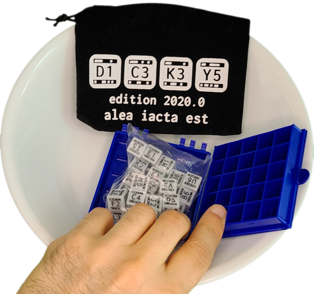
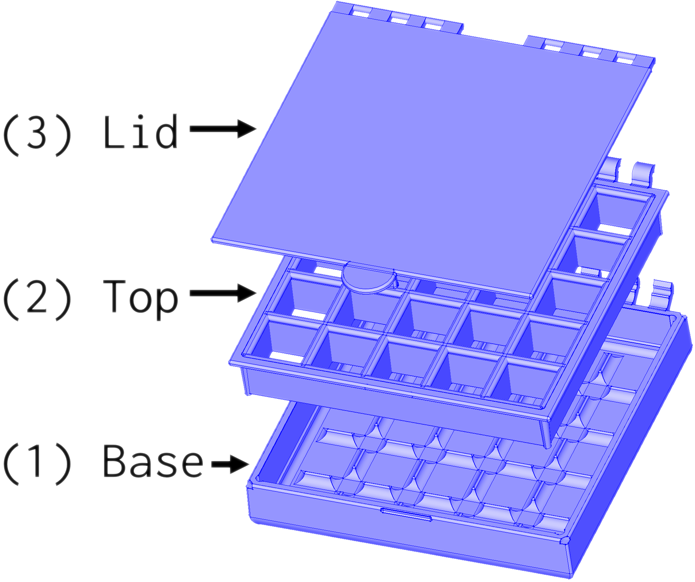
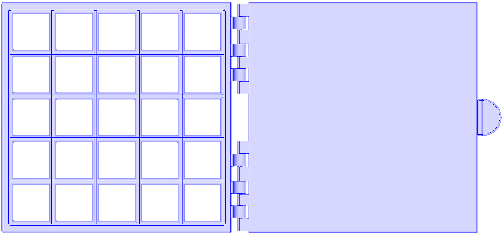
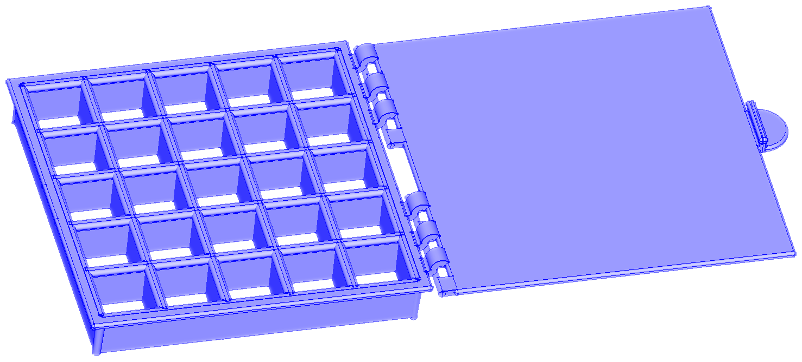

# Beta Program Instructions

## Before you get started

### **Important** Warnings

**Your DiceKey box will not re-open once closed.** 
 Do not push the top onto the box until:
  1. you have finished with all requested beta tasks,
  2. your dice are inside in the arrangement you want to make permanent, and
  3. have the attached the lid (3) to the hinge on the box top (3).

Do not open near small children or pets, or in places where parts might be lost if dropped.

### Your rights as a beta tester

We chose not to require you to sign any agreement before joining our beta program.

That means the test hardware is _yours_ to keep, though it does not replace the production hardware that you may have ordered, which will ship at a later date. You are free to share your experience with _your_ test hardware any way _you_ like.  We _request_ that you are courteous enough to make clear that this is test hardware and not necessarily what will be shipped to backers after testing completes.

Since the purpose of this hardware is for testing, we cannot guarantee that it won't have problems wit it or that we won't make significant changes in the production version that would require make our software work less well with beta hardware. Even if there are no problems to fix with the beta hardware, we _request_ that you not cancel your order for our production hardware or return it.

While you are not obligated to event report that you received the test hardware, we hope that you will do your best to complete the requested tasks and report your experience to us.

## Recording your experience

**We are relying on you** to share you experience with as much detail as you are comfortable providing. You can do so by recording video, taking still photos, recording audio, or by taking notes along the way.

If you are recording video or audio, we encourage you to speak your thoughts out loud during your experience.

To share your experience privately, you may email us at beta@dicekeys.com.

If you would like to share your experience where others can benefit from it, you may [File an issue in this repository](https://github.com/dicekeys/beta-program/issues/new) (requires a GitHub account) or submit a PR to this repository which adds a new directory with your experience under the [`experience-reports`](./experience-reports) directory.

## 1. Pre-Assembly

**The order of these steps is important**, as you may be unable to insert your dice or attach the lid if you close the box top (2) onto the base (1) prematurely!

    
    All the parts for your DiceKey in a large bowl

### 1. Unpack to reveal dice and the 3 parts of the box
Unpack the parts you received.  We recommend you start by placing all the parts in a large bowl to ensure nothing gets lost while you assemble your DiceKey.

    
    The box contains a (1) base, (2) top, and (3) lid.

The lid (3) of the box is mostly flat, with six small rectangular holes through which it will connect to the hinge on the box top.

The box top and base may look somewhat similar, as they are of roughly the same height and both have a 5x5 grid structure.

The base (1) has no holes, and has ridges that help move dice land into the correct positions when they are rolled.  The box top (2) has 25 square holes through which you will be able to see your dice after the top is merged with the base.

### 2. Attach the lid to the box top.

The box's lid should be attached to the box's top before the box's top is joined with the box's bottom.  Once the box's top and bottom are closed, you may not be able to insert the dice into the box or the lid into the hinge without breaking the box.

To attach the box's lid (3) to the box top (2), place the two parts next to each other with the hinges aligned.  The top of the box top (2) is the side with the rim.

    
    View from above
    
    View from the side 
    <b>Attaching the box's lid to the box's top by placing the two parts side by side.</b> 
    The hinges should and the lid's latch should faces up.  (If the lid latch faces down, the hinge should not line up.)

Once the parts are aligned, rotate the lid (3) around the hinge on the box top (2) until the latch snaps down and the two parts are joined.

### 3. Roll your 25 dice into the box base

You may mix them up in the felt bag, roll them in your hands, or simply drop them from the plastic bag into the box base.  Use your hands to drop any that fall back into the box back in and to line them up into a 5x5 grid so that they fall nicely into place.

**Do not push the box top (2) and lid (3) onto the base yet.**  As this is a beta test, we will want you to use the app and record what happens.  The app should work with just the dice and the box base, and you will want to re-roll a new key after sending us photos of this temporary key.

### 4. Scan the test key with the DiceKeys app.

Got to https://dicekeys.app/ with the browser on your mobile phone, tablet, or camera-enabled computer.  Try to scan in the key and report what happens.  You may also try to generate a password for a password manager.

### 5. Take a few pictures of the temporary key

Take some photographs of your temporary key as you would when scanning the app, so we can build our database of images used to test our scanning algorithm.

### 6. Roll your dice to create your permanent key

If you have been recording your experience, you should stop to ensure you don't accidentally record your permanent key.

### 7. Rest the assembled top (2) and lid (3) on the base (1).
The hinges on the top (2) and base(1) should be aligned so that they will seal the lid within the hinge.

The box should be ready to close.
The dice should not be visible.

Once the dice are no longer video, you may once again record video if you so choose.

### 8. Close the box to seal everything together.

Be sure to stop any recording before opening the box.

### 9. Please send your report to us.

Once again, you mail email it to us at beta@dicekeys.com, you may [File an issue in this repository](https://github.com/dicekeys/beta-program/issues/new) (requires a GitHub account) or submit a PR to this repository which adds a new directory with your experience under the [`experience-reports`](./experience-reports) directory.

Let us know if you'd like your name kept private or included in any acknowledgements of those who have contributed to DiceKeys by participating in our beta program.
